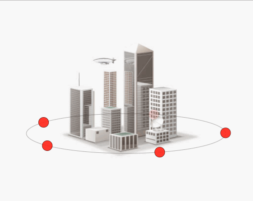
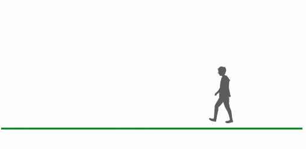

本工程使用webpack，babel构建 

webpack.dev.js时开发启动时webpack配置 

webpack.conf.js是xcharts文件的配置 

项目不使用Vue，React等框架，所以需要自己手动搭建前端项目，本项目可作为参考。 

有问题可以给作者留言或发送邮件至472784995@qq.com。 
欢迎一起讨论，学习。

本工程构建的目的是用于学习canvas。 

画饼图 
正常： 
 
鼠标悬停放大: 
 

旋转动画实现，[源码地址](./demo/rotate.html) 
 

行走动画实现[源码地址](./demo/walk.html) 
 